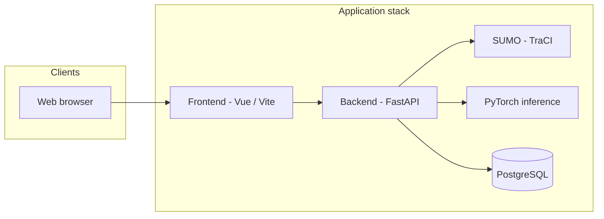

# TrafficLab — Operations & Readiness Report

**Document purpose:** Summarize what TrafficLab is, confirm that the application stack responds on a live run, and provide **CPU-only** server sizing guidance for web deployment.  
**Audience:** Management and infrastructure planning.  
**Date:** 9 April 2026  
**Environment sampled:** Development host `lab1` (Linux x86_64) with Docker Compose stack running.

---

## Executive summary

TrafficLab is a **traffic simulation and ETA prediction** platform: a **Vue.js** web UI, a **FastAPI** backend, **SUMO** for microscopic traffic simulation, **PyTorch** (CPU in current Docker setup) for ML-based ETA inference, and **PostgreSQL** for journey data.

On the sampled run:

| Check | Result |
|--------|--------|
| Backend health (`GET /health`) | **HTTP 200** — `{"status":"healthy"}` |
| Frontend (dev server, port 3000) | **HTTP 200** |
| PostgreSQL (port 5432) | **Listening** (containerized) |
| SUMO simulation process | **Running** (TraCI remote simulation) |

**Observed memory (container-level, `docker stats`, same host):** **backend ~483 MiB**, **db ~28 MiB**, **frontend ~123 MiB** (total ~**634 MiB** for the three containers). **Observed CPU (same snapshot):** backend **~43%** of one host CPU (SUMO + PyTorch active; not a steady-state idle figure). These are **point-in-time** samples, not peaks under many concurrent users.

**Recommendation for a dedicated CPU-only production host (single-tenant, full stack):**

| Resource | Minimum | Recommended |
|----------|-----------|-------------|
| **vCPU / cores** | 2 | **4–8** |
| **RAM** | 8 GB | **16 GB** |
| **Storage (SSD)** | 50 GB | **100 GB** |

Use **SSD** storage for PostgreSQL and logs. Scale vCPU/RAM up if you expect many concurrent users or always-on heavy simulation.

---

## What was verified (technical)

- **Endpoints:** `http://127.0.0.1:8000/health` returned healthy JSON. `http://127.0.0.1:3000/` returned HTTP 200.
- **Processes:** `uvicorn` (FastAPI), `node` (Vite), `sumo` (simulation), and `postgres` were present and bound to the expected ports.
- **Measurement method:** Host `ps` RSS summed across the main PIDs for those services at snapshot time (see “Observed footprint” below).

---

## Architecture (high level)



**Docker Compose services (development):** `frontend` (port 3000), `backend` (port 8000), `db` (Postgres 15, port 5432).

---

## Data and disk (repository)

Approximate sizes on the evaluated tree (for capacity planning and backups):

| Path / item | Approximate size |
|-------------|------------------|
| Full project tree | ~1.1 GB |
| `backend/dataset/` (graph step files) | ~748 MB |
| `backend/sumo/` (network, configs) | ~40 MB |
| `backend/models/moe_best.pt` (checkpoint) | ~9.4 MB |

PostgreSQL volume growth depends on **retention** of journeys and analytics in production.

---

## Observed footprint (sampled host)

| Host attribute | Value |
|------------------|--------|
| Logical CPUs | 32 |
| RAM (total) | 60 GiB |
| Root filesystem free | ~1.7 TB available (3% used on sampled volume) |

**Process-level snapshot (earlier):** ~**857 MB** RSS summed across selected PIDs (includes uvicorn worker ~521 MiB).

**Docker cgroup snapshot (authoritative for containers):**

| Container | CPU % | Memory (reported) | PIDs |
|-----------|-------|---------------------|------|
| `trafficlab-backend-1` | ~42.7% | ~482.6 MiB | 84 |
| `trafficlab-db-1` | ~0% | ~28.1 MiB | 8 |
| `trafficlab-frontend-1` | ~0.04% | ~122.6 MiB | 57 |

**Docker disk (same host):** images **~13.5 GB** (three images in use), local volumes **~167 MB**, build cache **~8.8 GB** (much of which is reclaimable with `docker builder prune` when not building).

**Interpretation:** Production should not assume **~0.6–0.9 GiB** container memory is the ceiling. PyTorch, SUMO, and Postgres grow under load; reserve **16 GB RAM** on a single host for headroom, monitoring, and OS cache.

---

## Production deployment notes (non-functional)

- **Secrets:** Replace default database credentials and use environment-specific configuration.
- **HTTPS:** Production Compose in this repo references nginx + TLS; certificates and domain must be configured for public web.
- **Monitoring:** Track container or process CPU/RAM, API latency, and Postgres disk usage in production.

---

## Appendix: Reproducing this report

From the repository root, with the stack running:

```bash
./scripts/collect-runtime-snapshot.sh
```

Manual checks:

```bash
curl -s http://127.0.0.1:8000/health
curl -s -o /dev/null -w "frontend HTTP %{http_code}\n" http://127.0.0.1:3000/
```

To capture live container resource usage (requires Docker CLI access):

```bash
docker stats --no-stream
```

---

*This report was generated from live checks on the sampled host plus static repository metrics. Re-run checks after major upgrades or before procurement sign-off.*
